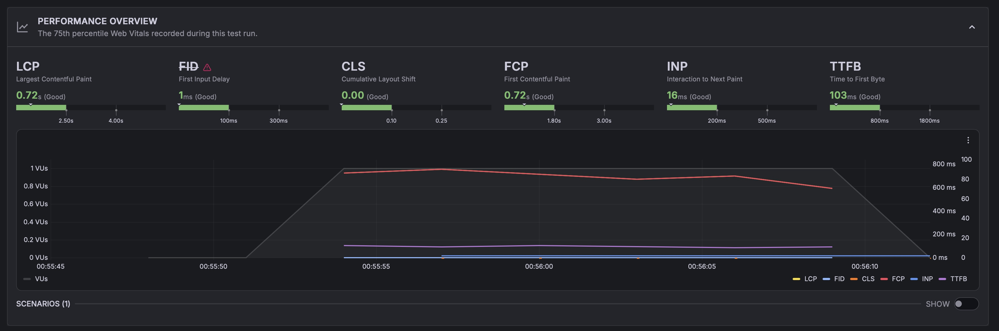
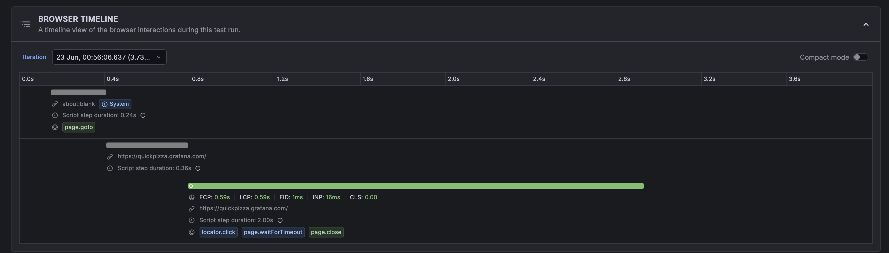
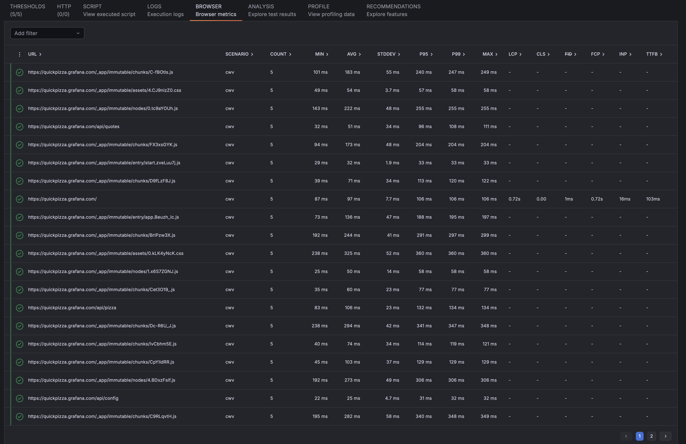
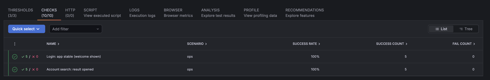
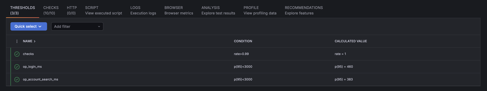
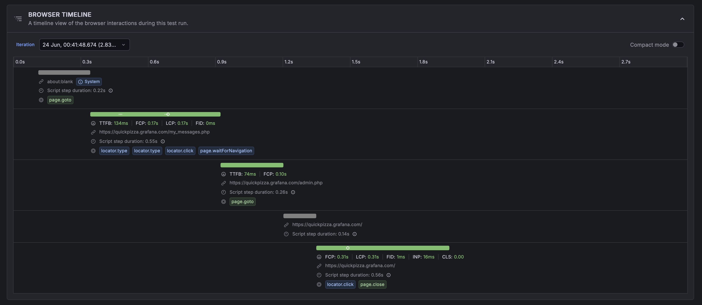

# ShopLite Load Tests — Grafana k6

Performance test for the **ShopLite** e-commerce API, implemented with **Grafana k6**.
It mirrors the same user journey as the [JMeter version](https://github.com/scherednychenko/ShopLite-load-tests):
**Browse catalog → Add to cart (N items) → Checkout**, against placeholder endpoints
served by a tiny local mock backend.

This repo is part of a small series implementing the *same* scenario in different tools
(JMeter, k6, Locust, Gatling) so they can be compared directly.

> 💡 **The script is the easy part.** The real value is knowing *what* to test, shaping the load model, reading the results, and turning them into a go/no-go call — judgment a demo can't capture.

> **Note.** This is a personal portfolio project — a from-scratch reconstruction
> built entirely on public, open-source tools against a fictional storefront. It is
> not affiliated with, and contains no material from, any employer or client.

## Contents
- `k6/script.js` — the test: 3 transactions (groups), parameterized via env vars, SLOs as thresholds
- `k6/browser-cwv.js` — browser/frontend companion: Core Web Vitals (LCP/INP/CLS/FCP/TTFB) via the
  `k6/browser` module, scored at p75 against Google thresholds; runs locally and in k6 Cloud
- `k6/business-ops.js` — **business-operation timing**: times named user operations (Login,
  Account Search) with custom `Trend` metrics + `check()`s + SLO thresholds — what stakeholders track
- `mock/` — dependency-free mock backend for the 3 placeholder endpoints
- `docker-compose.yml` — one-command demo (mock → k6 → HTML report)
- `docs/Proposed_Test_Approach.md` — performance testing strategy (SLIs/SLOs, cadence, Agile fit)
- `docs/Project_Brief.md` — anonymized project brief / context

## Run everything in Docker (one command)
```bash
docker compose up --build
```
k6 waits for the mock to be healthy, runs the scenario, and writes `report.html`
+ `summary.json` to `results/`. Open `results/report.html` when it finishes.

## The test
Three transactions, grouped for per-step metrics:
- **Browse Catalog** — `GET /api/catalog`
- **Add To Cart** — `POST /api/cart/items` ×`CART_SIZE`, correlates `cartId`
- **Checkout** — `POST /api/orders` with unique guest data, correlates `orderId`

### SLOs (k6 thresholds — the run fails if breached)
| Threshold | Budget |
|---|---|
| `http_req_failed` | error rate < 1% |
| `http_req_duration` | p95 < 500 ms |
| `checks` | assertion pass rate > 99% |

### Tunable via env vars
`BASE_URL`, `VUS` (virtual users), `DURATION`, `CART_SIZE`. Example (without Docker, needs a local k6):
```bash
k6 run -e BASE_URL=http://localhost:8080 -e VUS=20 -e DURATION=2m -e CART_SIZE=50 k6/script.js
```

## Browser test — Core Web Vitals (lab + k6 Cloud)
`k6/browser-cwv.js` is the frontend companion to the protocol test above: it drives a real
Chromium via the [`k6/browser`](https://grafana.com/docs/k6/latest/using-k6-browser/) module and
gates **Core Web Vitals** (LCP/INP/CLS/FCP/TTFB) at the 75th percentile against Google's "good"
thresholds — the same SLOs-as-code idea, applied to the rendered frontend. Point `BASE_URL` at any
public site (a demo, your app, a client's staging URL).

```bash
# local (needs a recent k6 — the browser module is stable since v0.52):
k6 run -e BASE_URL=https://quickpizza.grafana.com/ k6/browser-cwv.js

# Grafana Cloud k6 — same script, Web Vitals shown in the cloud results UI:
k6 cloud run -e BASE_URL=https://quickpizza.grafana.com/ k6/browser-cwv.js
```

- The cloud runs on Grafana's load zones, so `BASE_URL` must be **publicly reachable** (not localhost).
- A run can legitimately **fail** a threshold (that's the point) — e.g. a site whose p75 FCP > 1.8s.
- **INP** needs real interactions; it populates on real sites/RUM far better than on synthetic mocks.

A real k6 Cloud run of this script (Columbus load zone, 1 VU) — all six Web Vitals scored **Good**
at p75, the **5/5 thresholds passed**, and k6's Cloud Insights rated it **92 / 100 / 100**:



*Browser timeline* — the scripted steps (`page.goto` → `locator.click` → `page.close`) with each navigation's vitals:



*Browser metrics* — per-request timings and Web Vitals for every resource the page loaded:



## Business-operation timing — Checks & custom metrics
Stakeholders don't track LCP — they track *"how long did it take a user to **log in** / **search for
an account**?"*. `k6/business-ops.js` measures exactly that, the way a real team wires it up:

- a custom **`Trend`** metric per operation (`op_login_ms`, `op_account_search_ms`) — the **timing**
  the business dashboard shows (e.g. login p95);
- a **`check()`** per operation (did it succeed / open?) — pass/fail that surfaces in the
  k6 / Grafana Cloud **Checks** view, right next to Thresholds;
- **`thresholds`** on those metrics + on `checks` — the **SLO gate** that fails CI on a regression.

```js
const loginMs = new Trend("op_login_ms", true);
// ...time from submitting credentials to the app being stable...
loginMs.add(Date.now() - t0);
check(welcome, { "Login: app stable (welcome shown)": (t) => t.includes("Welcome") });
// options.thresholds: { op_login_ms: ["p(95)<3000"], checks: ["rate>0.99"] }
```

```bash
k6 run k6/business-ops.js          # local
k6 cloud run k6/business-ops.js    # cloud — Checks show up beside Thresholds
```

The two operations run against public demo sites as **stand-ins** (test.k6.io login, a quickpizza
query→result) — swap the URLs/selectors for the real app, keep the shape. Web Vitals
(`browser-cwv.js`) stay underneath as **diagnostics**: when an operation's p95 creeps up, you drill
into LCP/INP/network to find out *why*.

A real k6 Cloud run of `business-ops.js` — the operation checks land in the **Checks** view, right
next to **Thresholds**, exactly how a stakeholder reads it:



The matching **Thresholds** — the SLO gate on each operation's p95 plus the overall check rate:



The **browser timeline** shows the scripted steps each operation is timed across (`locator.type` →
`locator.click` → `waitForNavigation`, etc.):



## Sample report

A run against the local mock backend (all green):


## Notes
- Endpoints are placeholders; the mock returns the minimal contract (`cartId`/`orderId`) so the journey runs green.
- The mock's latencies are illustrative only — this demonstrates the tooling and reporting, not real system performance.
- The HTML report is generated via [k6-reporter](https://github.com/benc-uk/k6-reporter) in `handleSummary`.

## One scenario, six tools

The same ShopLite journey (browse → add-to-cart → checkout) is implemented across five load-testing tools (plus a frontend Core Web Vitals one) — each as a one-command Dockerized demo with an HTML report:

| Tool | Language / DSL | SLOs as | Report | Repo |
|---|---|---|---|---|
| Apache JMeter | XML + Groovy | Assertions | HTML dashboard | [ShopLite-load-tests](https://github.com/scherednychenko/ShopLite-load-tests) |
| Grafana k6 | JavaScript | Thresholds | HTML report | [ShopLite-load-tests-k6](https://github.com/scherednychenko/ShopLite-load-tests-k6) |
| Locust | Python | Code-level checks | Built-in HTML | [ShopLite-load-tests-locust](https://github.com/scherednychenko/ShopLite-load-tests-locust) |
| Gatling | Scala DSL | Assertions | HTML charts | [ShopLite-load-tests-gatling-scala](https://github.com/scherednychenko/ShopLite-load-tests-gatling-scala) |
| Gatling | Java DSL | Assertions | HTML charts | [ShopLite-load-tests-gatling-javaDSL](https://github.com/scherednychenko/ShopLite-load-tests-gatling-javaDSL) |
| sitespeed.io | JavaScript | Budgets | HTML + Grafana | [ShopLite-ui-perf](https://github.com/scherednychenko/ShopLite-ui-perf) |
| **Observability** | InfluxDB + Grafana | — | Live dashboards | [ShopLite-observability](https://github.com/scherednychenko/ShopLite-observability) |

> **Sample failure report** — red dashboards + a short analysis of one deliberately broken run (errors, KO, slow Core Web Vitals): [ShopLite-observability/reports](https://github.com/scherednychenko/ShopLite-observability/tree/main/reports).
