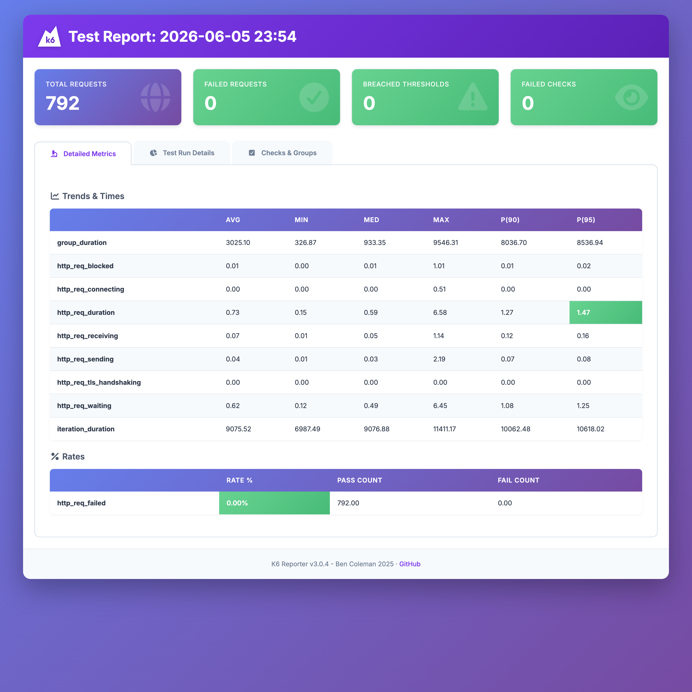

# ShopLite Load Tests — Grafana k6

Performance test for the **ShopLite** e-commerce API, implemented with **Grafana k6**.
It mirrors the same user journey as the [JMeter version](https://github.com/scherednychenko/ShopLite-load-tests):
**Browse catalog → Add to cart (N items) → Checkout**, against placeholder endpoints
served by a tiny local mock backend.

This repo is part of a small series implementing the *same* scenario in different tools
(JMeter, k6, Locust, Gatling) so they can be compared directly.

> 💡 **The script is the easy part.** The real value is knowing *what* to test, shaping the load model, reading the results, and turning them into a go/no-go call — judgment a demo can't capture.

> **Note.** This is a personal portfolio project — a from-scratch reconstruction
> built entirely on public, open-source tools against a fictional storefront. It is
> not affiliated with, and contains no material from, any employer or client.
## Contents
- `k6/script.js` — the test: 3 transactions (groups), parameterized via env vars, SLOs as thresholds
- `mock/` — dependency-free mock backend for the 3 placeholder endpoints
- `docker-compose.yml` — one-command demo (mock → k6 → HTML report)
- `docs/Proposed_Test_Approach.md` — performance testing strategy (SLIs/SLOs, cadence, Agile fit)
- `docs/Project_Brief.md` — anonymized project brief / context

## Run everything in Docker (one command)
```bash
docker compose up --build
```
k6 waits for the mock to be healthy, runs the scenario, and writes `report.html`
+ `summary.json` to `results/`. Open `results/report.html` when it finishes.

## The test
Three transactions, grouped for per-step metrics:
- **Browse Catalog** — `GET /api/catalog`
- **Add To Cart** — `POST /api/cart/items` ×`CART_SIZE`, correlates `cartId`
- **Checkout** — `POST /api/orders` with unique guest data, correlates `orderId`

### SLOs (k6 thresholds — the run fails if breached)
| Threshold | Budget |
|---|---|
| `http_req_failed` | error rate < 1% |
| `http_req_duration` | p95 < 500 ms |
| `checks` | assertion pass rate > 99% |

### Tunable via env vars
`BASE_URL`, `VUS` (virtual users), `DURATION`, `CART_SIZE`. Example (without Docker, needs a local k6):
```bash
k6 run -e BASE_URL=http://localhost:8080 -e VUS=20 -e DURATION=2m -e CART_SIZE=50 k6/script.js
```

## Sample report

A run against the local mock backend (all green):



## Notes
- Endpoints are placeholders; the mock returns the minimal contract (`cartId`/`orderId`) so the journey runs green.
- The mock's latencies are illustrative only — this demonstrates the tooling and reporting, not real system performance.
- The HTML report is generated via [k6-reporter](https://github.com/benc-uk/k6-reporter) in `handleSummary`.

## One scenario, six tools

The same ShopLite journey (browse → add-to-cart → checkout) is implemented across five load-testing tools (plus a frontend Core Web Vitals one) — each as a one-command Dockerized demo with an HTML report:

| Tool | Language / DSL | SLOs as | Report | Repo |
|---|---|---|---|---|
| Apache JMeter | XML + Groovy | Assertions | HTML dashboard | [ShopLite-load-tests](https://github.com/scherednychenko/ShopLite-load-tests) |
| Grafana k6 | JavaScript | Thresholds | HTML report | [ShopLite-load-tests-k6](https://github.com/scherednychenko/ShopLite-load-tests-k6) |
| Locust | Python | Code-level checks | Built-in HTML | [ShopLite-load-tests-locust](https://github.com/scherednychenko/ShopLite-load-tests-locust) |
| Gatling | Scala DSL | Assertions | HTML charts | [ShopLite-load-tests-gatling-scala](https://github.com/scherednychenko/ShopLite-load-tests-gatling-scala) |
| Gatling | Java DSL | Assertions | HTML charts | [ShopLite-load-tests-gatling-javaDSL](https://github.com/scherednychenko/ShopLite-load-tests-gatling-javaDSL) |
| sitespeed.io | JavaScript | Budgets | HTML + Grafana | [ShopLite-ui-perf](https://github.com/scherednychenko/ShopLite-ui-perf) |
